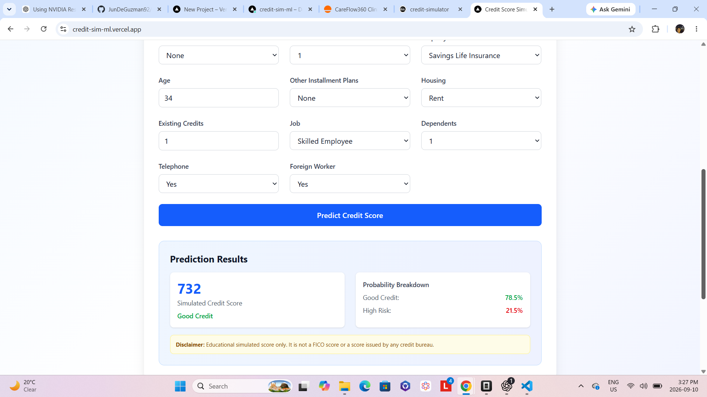

# Credit Score Simulator

A full-stack machine learning application that simulates credit risk assessment using the UCI German Credit dataset. Built with FastAPI, LightGBM, Next.js, and TypeScript.

## Live Demo

- **App**: https://credit-sim-ml.vercel.app
- **API**: https://credit-simulator-production.up.railway.app
- **API Docs**: https://credit-simulator-production.up.railway.app/docs



## Features

- **ML-Powered Predictions**: LightGBM classifier trained on 1000+ German credit records
- **RESTful API**: FastAPI backend with automatic OpenAPI documentation
- **Interactive Frontend**: Next.js 14 with TypeScript and Tailwind CSS
- **Real-time Validation**: Pydantic schemas ensuring data integrity
- **Comprehensive Testing**: pytest suite with 100% endpoint coverage
- **Ethical AI**: Clear disclaimers distinguishing simulated scores from real credit bureau data

## Tech Stack

**Backend**: Python 3.14, FastAPI, LightGBM, scikit-learn, Pandas, Pydantic v2  
**Frontend**: Next.js 14, React 18, TypeScript, Tailwind CSS, shadcn/ui  
**Shared**: TypeScript contracts for type safety across the stack

## Project Structure

```
credit-simulator/
├── backend/              # FastAPI ML service
│   ├── model.py          # Training pipeline & evaluation
│   ├── api.py            # REST API endpoints
│   ├── schemas.py        # Pydantic validation models
│   ├── tests/            # pytest test suite
│   └── data/             # UCI German Credit dataset
├── frontend/             # Next.js web application
│   ├── app/              # App router pages
│   ├── components/       # Reusable UI components
│   └── lib/              # Utility functions
├── shared/               # Shared TypeScript types
└── README.md             # This file
```

## Quick Start

### Prerequisites

- Python 3.14+
- Node.js 18+
- npm or yarn

### Backend Setup

```bash
# Navigate to backend
cd backend

# Create virtual environment
python -m venv .venv
.venv\Scripts\activate  # Windows
# source .venv/bin/activate  # macOS/Linux

# Install dependencies
pip install -r requirements.txt

# Train the model (first time only)
python -m backend.model

# Start the API server
uvicorn api:app --reload
```

API will be available at `http://localhost:8000`  
Interactive docs at `http://localhost:8000/docs`

### Frontend Setup

```bash
# Navigate to frontend
cd frontend

# Install dependencies
npm install

# Start development server
npm run dev
```

App will be available at `http://localhost:3000`

## API Endpoints

| Method | Endpoint | Description |
|--------|----------|-------------|
| GET | `/` | API status |
| GET | `/health` | Model health check |
| POST | `/predict` | Credit risk prediction |

### Example Request

```bash
curl -X POST http://localhost:8000/predict \
  -H "Content-Type: application/json" \
  -d '{
    "checking_status": "0-to-200",
    "duration_months": 24,
    "credit_history": "existing-paid",
    "purpose": "radio-tv",
    "credit_amount": 3500.0,
    "savings": "100-to-500",
    "employment": "1-to-4",
    "installment_rate": 2,
    "personal_status": "male-single",
    "other_debtors": "none",
    "residence_years": 3,
    "property": "real-estate",
    "age": 32,
    "other_installment_plans": "none",
    "housing": "own",
    "existing_credits": 1,
    "job": "skilled-employee",
    "dependents": 1,
    "telephone": "yes",
    "foreign_worker": "yes"
  }'
```

## Model Details

**Algorithm**: LightGBM Classifier  
**Dataset**: [UCI Statlog (German Credit Data)](https://archive.ics.uci.edu/dataset/144/statlog+german+credit+data) (1000 samples, 20 features)  
**Target**: Binary classification (good credit / high-risk credit)

**Evaluation Metrics**:
- Accuracy: 76.5%
- Precision: 65.1%
- Recall: 46.7%
- F1-Score: 54.4%
- ROC-AUC: 0.79

## Deployment

The app is deployed with the frontend on **Vercel** (https://credit-sim-ml.vercel.app) and the backend API on **Railway** (https://credit-simulator-production.up.railway.app).

### Deploy to Production

Deploy in this order: **backend first**, then frontend (the frontend needs the backend URL).

#### 1. Backend (Railway)

1. Go to [railway.app](https://railway.app) → **Sign in with GitHub**
2. **New Project** → **Deploy from GitHub repo** → select `credit-simulator`
3. In the project **Settings**:
   - **Root Directory**: `backend`
   - Railway auto-detects the `Dockerfile` and builds from it
4. In **Variables**, add:
   - `FRONTEND_ORIGINS` = your Vercel URL (add after step 2; use `*` temporarily for testing)
5. In **Settings → Networking**, click **Generate Domain** to get your API URL
   (e.g. `https://credit-simulator-api-production.up.railway.app`)
6. Verify: open `<your-railway-url>/health` — should return `{"status":"ok"}`

#### 2. Frontend (Vercel)

1. Go to [vercel.com](https://vercel.com) → **Sign in with GitHub**
2. **Add New Project** → **Import** `credit-simulator`
3. Configure:
   - **Framework Preset**: Next.js
   - **Root Directory**: `frontend`
   - **Environment Variable**: `NEXT_PUBLIC_API_URL` = your Railway URL from step 1
     (no trailing slash, e.g. `https://credit-simulator-api-production.up.railway.app`)
4. Click **Deploy**
5. Verify: open your Vercel URL and submit the form — a prediction should appear

#### 3. Final step: lock down CORS

Back in **Railway → Variables**, update:
- `FRONTEND_ORIGINS` = your actual Vercel URL (e.g. `https://credit-simulator.vercel.app`)

Both platforms auto-redeploy when you push to `main`.

#### Alternative: GitHub Integration

1. **Connect GitHub repo** to Railway and Vercel
2. **Auto-deploy** on push to `main` branch
3. **Environment variables** set in platform dashboards

## Testing

```bash
# Run backend tests
cd backend
pytest

# Run with coverage
pytest --cov=api --cov=schemas --cov-report=html
```

## Contributing

1. Fork the repository
2. Create feature branch (`git checkout -b feature/amazing-feature`)
3. Commit changes (`git commit -m 'Add amazing feature'`)
4. Push to branch (`git push origin feature/amazing-feature`)
5. Open Pull Request

## License

This project is for educational purposes only. The simulated credit scores are not affiliated with any credit bureau.

## Acknowledgments

- [Statlog (German Credit Data)](https://archive.ics.uci.edu/dataset/144/statlog+german+credit+data), UCI Machine Learning Repository
- FastAPI and scikit-learn communities
- Next.js and Vercel for the excellent developer experience

---

**Disclaimer**: This is an educational project demonstrating ML pipeline architecture. Simulated credit scores are for demonstration purposes only and do not reflect real credit bureau assessments.